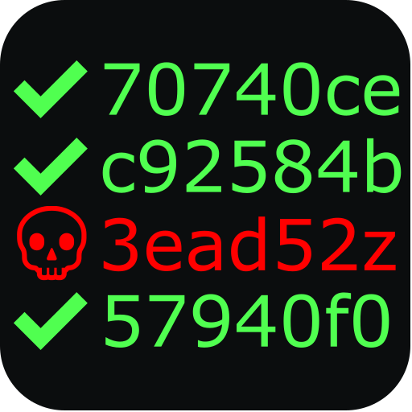

<div style="text-align:center"></div>

# Malicious Commit Detector

Application to detect which commit generates malicious code detection by antivirus software.

MCD use the [Virus Total](https://www.virustotal.com) web API to detect malicious code in files. You need a API key that you can get with a free Virus Total account.
A pro account is prefered if you have lot of files to check because the free version limit the number of request.

## Installation 

### From Nim pakage manager Nimble
```bash
nimble install mcd
```

### Executables
[Windows and Linux executable](https://gitlab.com/EchoPouet/malicious-commit-detector/mcd/-/releases)

Contributions are welcome.

[](https://www.buymeacoffee.com/EchoPouet)

## Analyze your project commits

First you must create a file to explain how build the project that you will test.

The file is a TOML format et must contains this keys:

* project_dir : path of the project source code. Absolute path or relative to this file.
* build_dir : folder where the commands must be run. Relative path to project_dir.
* build_command : a list of succesive commands to run to build your project. Relative path to project_dir.
* file_path : a list of all files to analyse. Relative path to project_dir.

See example file **tests\MaliciousTest\mcd-config.toml**.

To analyze the project's master branch, run the following command:
```
.\mcd.exe detectCommit -a=XXXXXXXXXX -c=c:\Users\A\mcd\tests\mcd-config.toml -b=master
Configuration file: c:\Users\A\mcd\tests\mcd-config.toml
🔍 Commit "70740ce"
🔨 Build
⏳ Wait analyze 25 sec ...
  analyze not completed, wait 25 sec ...
  analyze not completed, wait 25 sec ...
  analyze not completed, wait 25 sec ...
❌ malicious.exe
🔍 Commit "c92584b"
🔨 Build
⏳ Wait analyze 25 sec ...
  analyze not completed, wait 25 sec ...
  analyze not completed, wait 25 sec ...
  analyze not completed, wait 25 sec ...
✔️ malicious.exe
Commit "c92584b" is the last commit without generated malicous files
```

detectCommit help:
```
Usage:
  detectCommit [required&optional-params]
Detect first commit with malicious code
Options:
  -h, --help                             print this cligen-erated help
  --help-syntax                          advanced: prepend,plurals,..
  -a=, --apikey=       string  REQUIRED  API key of your VirusTotal account
  -c=, --config=       string  REQUIRED  config file to build binaries for each commit
  -s=, --startCommit=  string  ""        start commit
  -l=, --lastCommit=   string  ""        latest commit
  -b=, --branch=       string  ""        the branch where run detection
  -w=, --wait=         int     25        waiting time of the analysis in seconds
  -t=, --threshold=    int     2         detection threshold for false positive
```

## Analyze one file

To analyze one file, use **analyze** command.
```
.\mcd.exe analyze -a=XXXXXXXXXX .\clean.exe
⏳ Wait analyze 25 sec ...
✔️ clean.exe

.\mcd.exe analyze -a=XXXXXXXXXX .\malware.exe
⏳ Wait analyze 25 sec ...
  analyze not completed, wait 25 sec ...
❌ malware.exe
```

Analyze help:
```
Usage:
  analyze [required&optional-params] [paths: string...]
Check several files
Options:
  -h, --help                           print this cligen-erated help
  --help-syntax                        advanced: prepend,plurals,..
  -a=, --apikey=     string  REQUIRED  API key of your VirusTotal account
  -w=, --wait=       int     25        waiting time of the analysis in seconds
  -t=, --threshold=  int     2         detection threshold for false positive
```